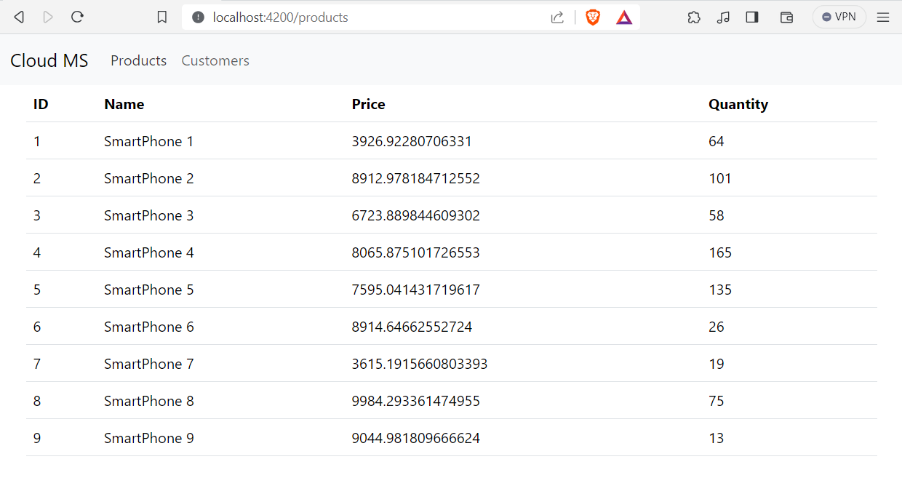
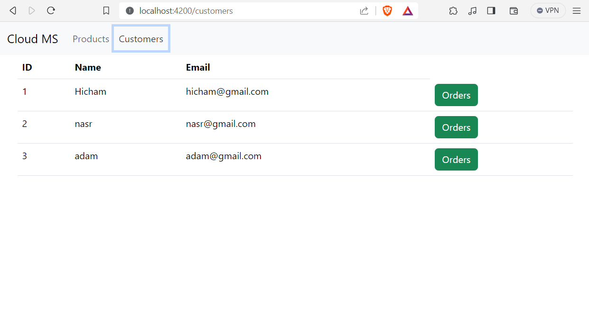
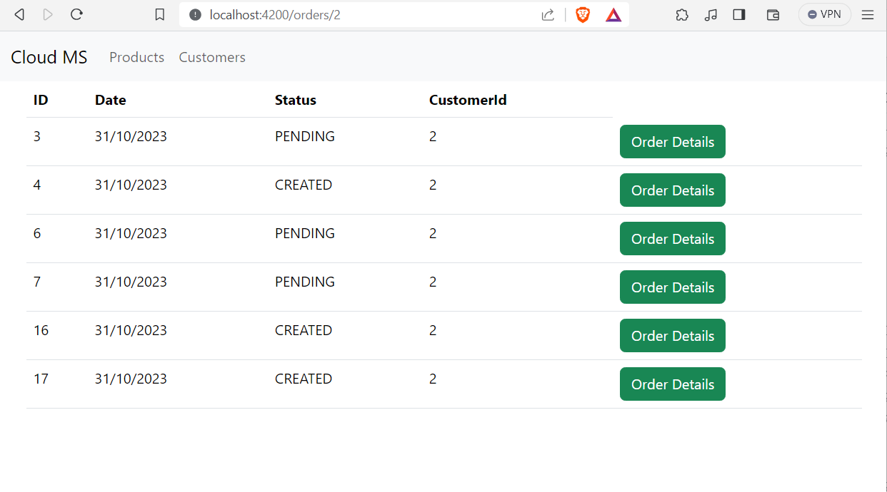
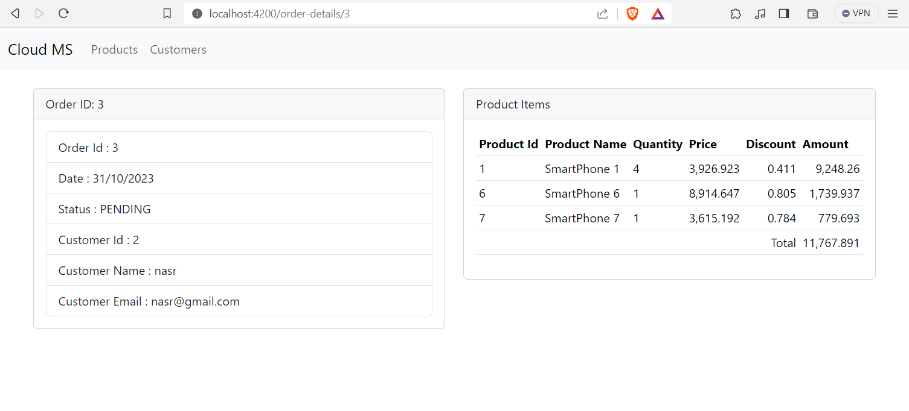

# Spring_Cloud_Micro_Services

## About
This repository resumes a small application of a micro service achitecture using Spring Boot. In this application, we will use newer technologies such as new technology like ConsulDiscovery ,Vault and also using dynamic methods to load parameters by the microservices, etc.

This project is distributed into several modules : 
 * **Config-service:** Responsible for managing configuration properties for all services.
 * **Gateway-service:** Acts as an API gateway, routing requests to the appropriate microservices.
 * **Customer-service:** Handles customer operations.
 * **Inventory-service:** Manages product and stock operations.
 * **Order-service:** Deals with order processing and management.
 * **Billing-service:** Manages billing and payment operations.

## Technologies

 

## Screenshots

